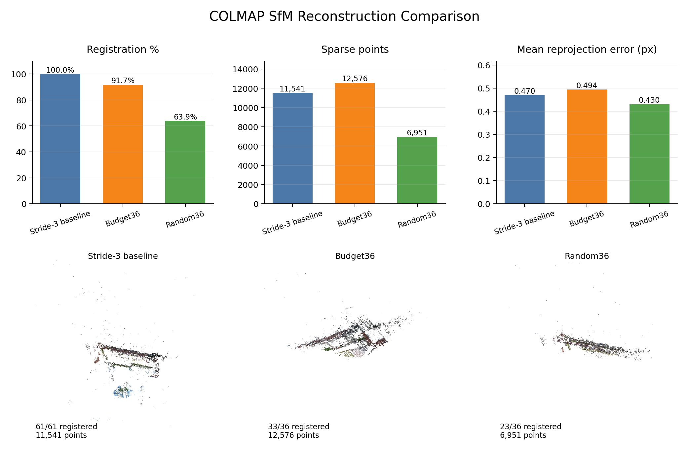

# COLMAP Frame-Selection Comparison

| Strategy | Input frames | Registered images | Registration % | Sparse points | Mean reproj. error (px) | PLY exported | PLY path | Runtime (s) |
| --- | --- | --- | --- | --- | --- | --- | --- | --- |
| All frames baseline (stride 3) | 61 | 61 | 100.00% | 11541 | 0.470058 | yes | `outputs/colmap_runs/all_or_stride/reconstruction.ply` | 100.90 |
| Budget-selected / masked frames | 36 | 33 | 91.67% | 12576 | 0.493910 | yes | `outputs/colmap_runs/budget36/reconstruction.ply` | 66.97 |
| Random baseline | 36 | 23 | 63.89% | 6951 | 0.430319 | yes | `outputs/colmap_runs/random36/reconstruction.ply` | 71.12 |

## Interpretation

Budget-selected frames outperform random frames for the same frame budget, registering more images and producing more sparse points, while the stride baseline remains the most stable overall.

## Preview Images

- `outputs/colmap_runs/all_or_stride_preview.png`
- `outputs/colmap_runs/budget36_preview.png`
- `outputs/colmap_runs/random36_preview.png`

Notes:
- All runs used CPU SIFT and forward 100 degree perspective crops from `outputs/frames/`.
- `all_or_stride` uses every third frame from the full walk to keep runtime manageable.
- `budget36` uses the existing selected-frame manifest at `outputs/colmap_input/budget36/frame_manifest.json`.
- `random36` uses a deterministic random sample of 36 frames written to `outputs/colmap_runs/random36_selection.txt`.
